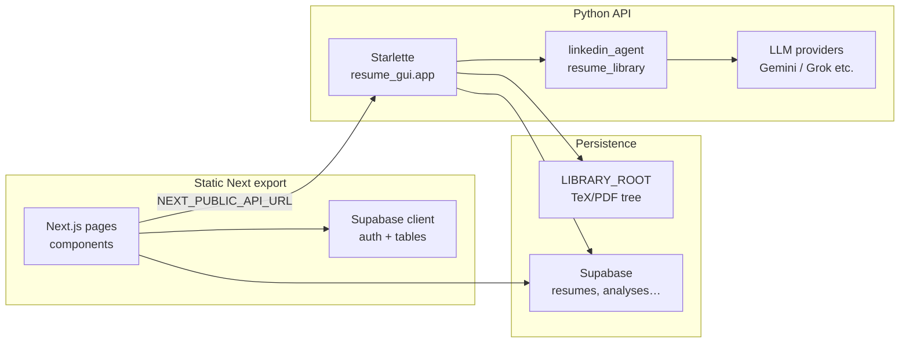

# Resunova — Architecture & design reference

Living document for engineers extending the product. When behavior changes materially, update this file in the same PR.

---

## 1. Purpose

**Resunova** helps job seekers improve résumés: AI-assisted **analysis** (scores, bullets, ATS hints), **tailored LaTeX generation**, **library** management, and optional **sharing**. The stack is intentionally split so the **marketing / app UI** can ship as a static site while **heavy I/O and LLM calls** run on a small Python API.

---

## 2. Repository map

| Area | Role |
|------|------|
| `web/` | **Next.js 16** app (React 19, TypeScript). **Static export** (`output: "export"`). Primary UX: landing, signed-in shell (`/r`), analyze, builder, library. |
| `resume_gui/` | **Starlette** HTTP API + optional legacy `index.html`. Serves JSON routes under `/api/*`, PDFs under `/pdf/…`, CORS-aware for the web origin. |
| `linkedin_agent/` | Python package: **LaTeX resume library**, JD extraction, streaming generation, doctor/ATS helpers. Imported by `resume_gui` (and historically by LangGraph tooling). `.env` here is loaded by `resume_gui/app.py` in dev. |
| `resume_gui/renderers/` + `resume_gui/templates/latex/` | Deterministic LaTeX scaffold (Jinja2) for future structured ResumeDoc rendering. |
| `docs/` | Deep dives (e.g. `analyze-preview-flow.md`) plus this file. |

Other folders (e.g. `.claude/`, editor worktrees) are tooling or experiments — **do not** treat them as deploy sources of truth.

---

## 3. High-level architecture

- **Browser** loads static assets (GitHub Pages / CDN-friendly) and calls **`NEXT_PUBLIC_API_URL`** for resume and analyze endpoints.
- **Auth and row-level metadata** use **Supabase** from the browser where configured.
- **Authoritative file artifacts** (per-user library on disk or storage abstraction) are owned by the API process.

---

## 4. Frontend (`web/`)

**Product UX, visual system, and screen map:** [PRODUCT_DESIGN.md](./PRODUCT_DESIGN.md) (includes Figma link).

### 4.1 Build & deploy

- **`next.config.ts`**: `output: "export"`, `trailingSlash: true`, `images.unoptimized`, optional **`basePath`** and **`assetPrefix`** for GitHub Pages or subpath hosting.
- **No server-side Next API routes** in production export; all backend logic is the Starlette app.

### 4.2 Environment

| Variable | Use |
|----------|-----|
| `NEXT_PUBLIC_API_URL` | Base URL for Starlette (default dev: `http://localhost:8765`). |
| `NEXT_PUBLIC_BASE_PATH` | App path prefix when not served from domain root. |
| `NEXT_PUBLIC_ASSET_PREFIX` | Absolute origin for `_next` static assets in some hosts. |
| `NEXT_PUBLIC_SUPABASE_URL` / `NEXT_PUBLIC_SUPABASE_PUBLISHABLE_KEY` | Auth + DB reads/writes from the client. |
| `USE_JINJA_LATEX_RENDERER` (API env) | Feature flag scaffold. Emits status + keeps legacy generator fallback until structured ResumeDoc wiring is complete. |

`apiUrl()` in `web/lib/utils.ts` joins paths to `NEXT_PUBLIC_API_URL`.

### 4.3 Routing & navigation

- **Marketing**: `/` via `HomePageClient` (landing vs signed-in redirect).
- **App shell**: **`/r`** — query-driven SPA-style views (`AppShell.tsx`): `?view=builder|library|analyze|profile|jobs`, builder sub-flows `?flow=…`, library deep links `?resume=<folder>`.
- **Legal / static**: `/contact`, `/privacy`, `/terms`, `robots.ts`, `sitemap.ts`.
- **Share resolve**: `/r/?id=<shortid>` resolves payload via `GET /api/share/<shortid>`.

### 4.4 State & data flow (analyze)

- **`web/store/resumeAnalyzeStore.ts`** (Zustand): extracted text, bullet analysis mirror, **line overrides** (session-only preview edits), pulse/highlight for UX sync with sidebar.
- **`web/lib/analysisCategoryMatch.ts`**: maps LLM `issues[]` strings and heuristics to **category keys** for highlighting and sidebar grouping. JSON key **`technicalBranding`** is still used in API payloads; the UI label is **field-agnostic** (“Field & depth”).
- **Preview pipeline**: `AnalyzeResume` → `AnalyzePreviewPane` → `AnnotatedResumePanel` + `AnalyzeLiveResumeBody` (parse bullets, `data-bullet-idx`). See **`docs/analyze-preview-flow.md`** for edge cases (synthetic extract, presentation-only mode, PDF export caveats).

### 4.5 Brand & copy

- **`web/lib/brand.ts`**: public URLs, contact emails, and **user-facing model name** (“Resunova Atlas”) so provider IDs stay internal.

### 4.6 UI / design system

- **Theming**: `data-theme="light|dark"` on `document.documentElement`; toggles persist e.g. `localStorage` (`rn-theme`). Landing and app should stay visually aligned (cool neutrals + blue accent pattern).
- **Tokens**: Prefer **CSS variables** (`var(--surface)`, `var(--text)`, `var(--accent)`, semantic reds/greens) defined in `web/app/globals.css` rather than one-off hex in feature code.
- **Responsive**: Analyze uses split grid on wide viewports and collapsible preview on narrow; respect existing breakpoints when adding panes.
- **Accessibility**: Interactive elements need visible focus; prefer native semantics (`button`, `details/summary`) before custom widgets.

### 4.7 Template customize: live HTML + LaTeX PDF

After a successful **template / studio** generate (`studioHandoff`), the builder shows **two** previews:

1. **Live preview (HTML)** — `ResumePaperView` with Style tab controls (accent, font size, spacing). Updates **client-side only**.
2. **LaTeX PDF (exported)** — iframe of the last compiled PDF from the server. Updates only after **Recompile PDF** (or the initial generate) finishes.

See **[LIVE_EDITOR_AND_LATEX.md](./LIVE_EDITOR_AND_LATEX.md)** for rationale, code pointers, and copy guidelines.

---

## 5. Backend (`resume_gui/`)

### 5.1 Runtime

- **Starlette** app assembled at bottom of `resume_gui/app.py`; run locally with `python resume_gui/app.py` or **`uvicorn resume_gui.app:app`** (Railway `Procfile`).
- **CORS**: `ALLOWED_ORIGINS` env (comma-separated); defaults include localhost and `resunova.io` hosts.
- **`LIBRARY_ROOT`**: filesystem root for per-user or local resume trees.

### 5.2 Notable HTTP routes

| Method | Path | Purpose |
|--------|------|---------|
| GET | `/api/resumes` | List resumes (`user_id` query → Supabase table first, else disk). |
| POST | `/api/upload-resume` | Upload / register PDF or TeX. |
| GET/POST | `/api/resume/{folder}` | Parsed tree GET; save POST. |
| POST | `/api/generate-stream` | SSE stream tailored LaTeX generation. |
| POST | `/api/analyze-upload`, `/api/analyze-folder/{folder}` | Full JSON analysis (scores, bullets, sections). |
| POST | `/api/extract-jd`, `/api/ai-edit-bullet`, `/api/doctor-check`, `/api/ats-check/{folder}` | JD + edits + checks. |
| POST/GET/DELETE | `/api/share/…` | Create / resolve / revoke share links. |
| GET | `/pdf/{folder}/{filename}` | Serve compiled PDFs. |

Exact signatures evolve — **grep `Route(` in `app.py`** when wiring new clients.

### 5.3 Analysis model (LLM contract)

- Prompt **`_ANALYSIS_PROMPT`** defines **UMBC-aligned** rubric, **discipline-agnostic** scoring (all majors), and JSON shape: `categoryScores`, `bulletAnalysis` (weakest bullets sample), `sectionFeedback`, `topIssues`, etc.
- **`technicalBranding`** remains the **canonical JSON key** for “field signals & professional depth” so stored rows and TypeScript types stay stable; prompts and UI copy describe the pillar in general terms.

### 5.4 Dependencies on `linkedin_agent`

- Heavy logic lives in **`linkedin_agent/resume_library.py`** (and related modules): parse TeX, splice bullets, stream generation, ATS/doctor, JD URL fetch.
- **`resume_gui/storage.py`**: Supabase storage helpers when enabled.

---

## 6. Cross-cutting concerns

### 6.1 Security

- Browser uses **publishable** Supabase key only; never ship service-role keys to `web/`.
- API must validate **user scoping** on mutating routes when Supabase auth headers or `user_id` are used; disk fallback is dev-oriented.
- **Share links**: short IDs resolve to snapshots — treat TTL / revocation as product requirements when extending.

### 6.2 Observability

- Python: `logging` in `resume_gui` with structured-ish messages on API entry.
- Client: use targeted `console.error` for failures; avoid logging PII or full résumé bodies in production builds.

### 6.3 Testing & quality gates

- `web`: `npm run lint`, `npx tsc --noEmit`, `npm run build` before release.
- Python: `python -m py_compile resume_gui/app.py` smoke; add `pytest` if/when a test suite lands.

---

## 7. Evolution guidelines

1. **Keep API JSON keys backward compatible** unless you run a migration; prefer new optional fields over renames.
2. **Document preview / analyze quirks** in `analyze-preview-flow.md` when changing store or extract heuristics.
3. **Field-agnostic language** in prompts and UI for scoring pillars (avoid “stack” or “GitHub” as defaults for everyone).
4. **Static export constraint**: new features that need secrets or server-only logic belong in **Starlette** (or Supabase RLS policies), not in “hidden” client code.

---

## 8. Related docs

- [Analyze: live preview column](./analyze-preview-flow.md) — Zustand, highlights, synthetic extract, PDF export limits.
- [Live editor vs LaTeX export](./LIVE_EDITOR_AND_LATEX.md) — template customize dual preview, `ResumePaperView`, when to recompile.
